# Hivemind Dataflow & Logic

## 🧠 Dataflow Diagram

```mermaid
flowchart TD
    User["🧑 User Query"]
    Dispatch["🌐 Fan-out<br>Send query to multiple models"]
    GPT4["🤖 GPT-4o"]
    Claude["🤖 Claude 3 Sonnet"]
    LLaMA["🤖 Meta LLaMA 3.1"]
    DeepSeek["🤖 DeepSeek Coder v2"]
    Pool["📦 Response Pool"]
    Judge["⚖️ Aggregator / Judge<br>(Logic & Ranking)"]
    Best["🏆 Best Answer"]
    Feedback["🔁 User Feedback"]

    User --> Dispatch
    Dispatch --> GPT4
    Dispatch --> Claude
    Dispatch --> LLaMA
    Dispatch --> DeepSeek

    GPT4 --> Pool
    Claude --> Pool
    LLaMA --> Pool
    DeepSeek --> Pool

    Pool --> Judge
    Judge --> Best
    Best --> User
    User --> Feedback
    Feedback --> Judge
```

---

## ⚖️ Logic for Choosing the Best Answer

### 1. Rule-Based Heuristics
- Completeness: did the answer cover all parts of the query?  
- Clarity & Length: avoid vague or overly short answers.  
- Error checks: does code compile, JSON validate, or references exist?  

### 2. LLM-as-a-Judge
- Send all responses to a strong model (e.g., GPT-4o).  
- Ask: *“Which of these answers best solves the query? Rank them and explain briefly.”*  

### 3. Ensemble Ranking
- Measure semantic similarity across answers.  
- If 3 models agree, rank consensus higher.  
- Deprioritize outliers or hallucinations.  

### 4. User Feedback Loop
- Present multiple answers.  
- Let the user pick the winner.  
- Store `(query, responses, chosen)` in DB for improving ranking over time.  

### 5. Hybrid Flow
- Apply heuristics first to remove broken answers.  
- Use LLM Judge to rank the survivors.  
- Allow user override as the ultimate decision.  

---

## 🔮 Summary
Hivemind is a **council of AI models**:  
- Each model provides an opinion.  
- A **judge layer** (rules + meta-model + user feedback) selects the best.  
- Over time, the system learns **which models perform best on which queries**, improving accuracy and trustworthiness.
